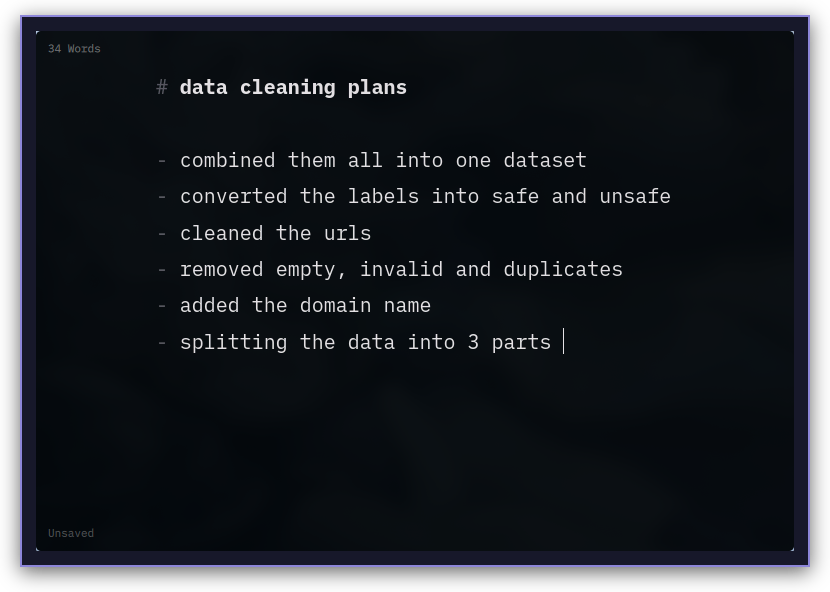

# paperfry

<p align="center">
  
</p>

A simple lightweight notepad app for linux. It's better than any notepad app available on linux at the moment.

## Showcase


<p align="center">
  
</p>

## Install

### Arch Linux

Install dependencies and install:

```sh
sudo pacman -S qt6-base qt6-declarative xdg-desktop-portal
git clone https://github.com/creepingthrumordor/paperfry.git
cd paperfry/bin
sudo ./install
```

## Theme Customization

Paperfry automatically follows your desktop's dark/light mode via the XDG desktop portal
(works on GNOME, KDE, and any portal-compatible desktop).

## Shortcuts

| Keys | Action |
| --- | --- |
| `Ctrl+S` / `Ctrl+Shift+S` | Save / save as |
| `Ctrl+O` | Open a Markdown file |
| `Ctrl+P` | Print |
| `Ctrl+N` | New window |
| `Ctrl+Z` / `Ctrl+Y` | Undo / redo |
| `Ctrl+F` / `Ctrl+H` | Find / replace |
| `Ctrl+B` / `Ctrl+I` / `Ctrl+K` | Bold / italic / link |
| `Ctrl+?` | Show shortcuts |
| `Shift+Enter` | Add spacing |

In search, use `Enter` or `Ctrl+G` for the next match and `Shift+Enter` for the previous one.

Unsaved drafts are recovered after an abnormal exit. Paperfry also watches open files
and warns before an external change can replace local work.

## Requirements

- Qt 6: `qt6-base`, `qt6-declarative`
- `xdg-desktop-portal` and a portal backend (e.g. `xdg-desktop-portal-gnome`, `xdg-desktop-portal-kde`, or `xdg-desktop-portal-gtk`)

The iA Writer Mono font is bundled under the SIL Open Font License 1.1; see
`fonts/OFL.txt`. The font is copyright Information Architects Inc. and based on
IBM Plex, copyright IBM Corp.

Logo drawn by me using [Pixilart](https://www.pixilart.com/).
