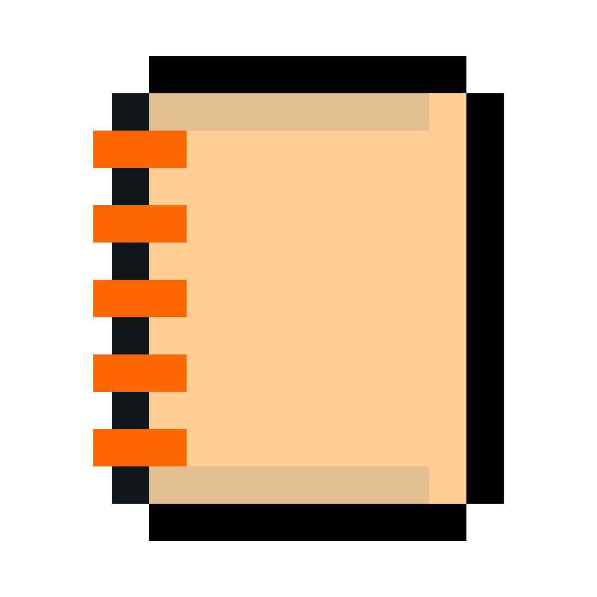

# paperfry

<p align="center">
  
</p>

A simple lightweight notepad app for linux. It's better than any simple notepad app available on linux at the moment.

## Install

### Arch Linux

Install dependencies and install:

```sh
sudo pacman -S qt6-base qt6-declarative xdg-desktop-portal
git clone https://github.com/creepingthrumordor/paperfry.git
cd paperfry/bin
sudo ./install
```

## Theme Customization

Paperfry automatically follows your desktop's dark/light mode via the XDG desktop portal
(works on GNOME, KDE, and any portal-compatible desktop).

## Shortcuts

- `Ctrl+S` saves. Unsaved documents use the XDG desktop portal file picker.
- `Ctrl+Shift+S` saves as.
- `Ctrl+O` opens a Markdown file through the portal picker.
- `Ctrl+P` opens the system print dialog.
- `Ctrl+N` opens a new Paperfry window.
- `Ctrl+Z`, `Ctrl+Shift+Z`, and `Ctrl+Y` handle undo and redo.
- `Super+F` toggles fullscreen. Qt maps this key as `Meta+F`.
- `Ctrl+F` searches the document. Use `Enter` or `Ctrl+G` for the next match and `Shift+Enter` for the previous match.
- `Ctrl+H` opens find and replace.
- `Ctrl+B`, `Ctrl+I`, and `Ctrl+K` insert bold, italic, and link Markdown.
- `Ctrl+?` shows the keyboard shortcut reference.

Unsaved drafts are recovered after an abnormal exit. Paperfry also watches open files
and warns before an external change can replace local work.

## Requirements

- Qt 6: `qt6-base`, `qt6-declarative`
- `xdg-desktop-portal` and a portal backend (e.g. `xdg-desktop-portal-gnome`, `xdg-desktop-portal-kde`, or `xdg-desktop-portal-gtk`)

The iA Writer Mono font is bundled under the SIL Open Font License 1.1; see
`fonts/OFL.txt`. The font is copyright Information Architects Inc. and based on
IBM Plex, copyright IBM Corp.
