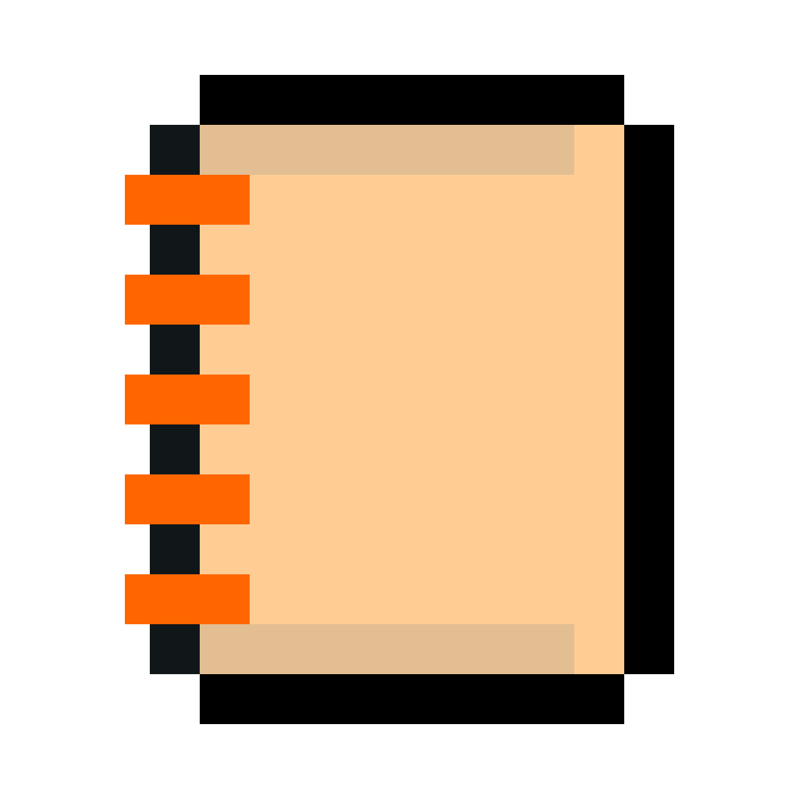
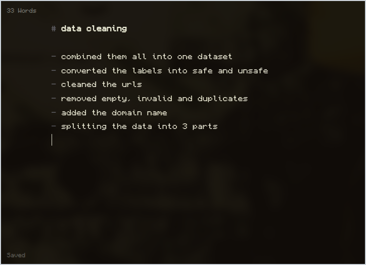

# paperfry

<p align="center">
  
</p>

A simple, lightweight notepad app for Linux that is better than any other notepad app currently available. It currently uses around 350 MB of RAM, which may be reduced in future updates

## Showcase


<p align="center">
  
</p>

## Install

### Arch Linux

Install dependencies and install:

```sh
sudo pacman -S qt6-base qt6-declarative xdg-desktop-portal
git clone https://github.com/creepingthrumordor/paperfry.git
cd paperfry/bin
sudo ./install
```

## Theme Customization

Paperfry automatically follows your desktop's dark/light mode via the XDG desktop portal
(works on GNOME, KDE, and any portal-compatible desktop).

## Shortcuts

| Keys | Action |
| --- | --- |
| `Ctrl+S` / `Ctrl+Shift+S` | Save / save as |
| `Ctrl+O` | Open a Markdown file |
| `Ctrl+P` | Print |
| `Ctrl+N` | New window |
| `Ctrl+Z` / `Ctrl+Y` | Undo / redo |
| `Ctrl+F` / `Ctrl+H` | Find / replace |
| `Ctrl+B` / `Ctrl+I` / `Ctrl+K` | Bold / italic / link |
| `Ctrl+?` | Show shortcuts |
| `Shift+Enter` | Add spacing |

Use `Enter` or `Ctrl+G` to move to the next search result, and `Shift+Enter` for the previous one.

Drafts are recovered after an abnormal exit, and open files are watched for external changes.

## Requirements

- Qt 6: `qt6-base`, `qt6-declarative`
- `xdg-desktop-portal` with a backend such as GNOME, KDE, or GTK

Logo drawn with [Pixilart](https://www.pixilart.com/).
